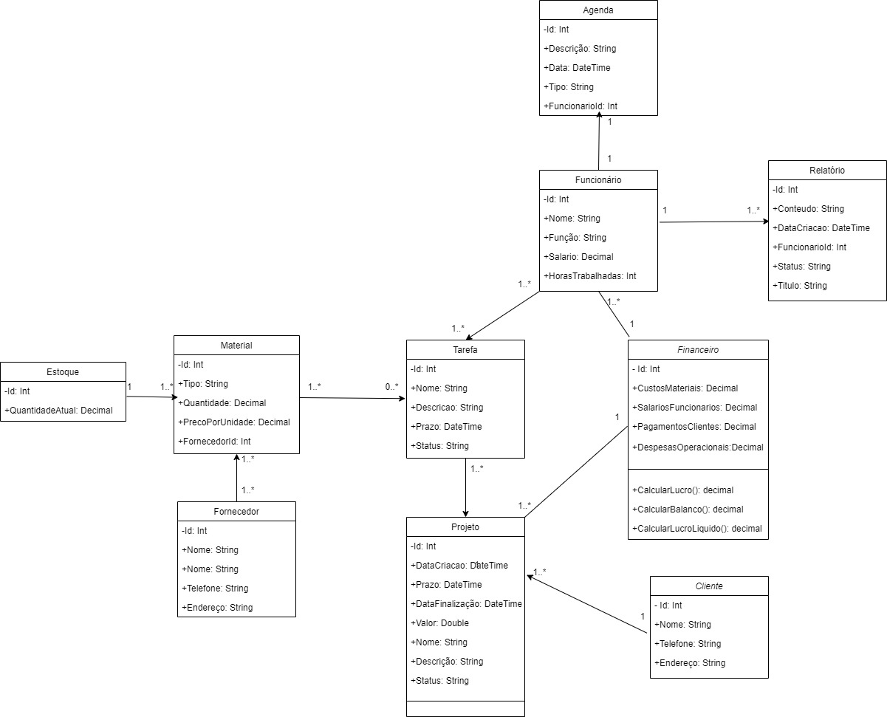

### CarpentryAPI Documentation

## Project Summary

CarpentryAPI is a management application for a fictional carpentry called Carpintech. It offers functionalities to control employees, schedules, suppliers, customers, and materials used in the carpentry projects. The goal is to improve operational efficiency, increase visibility on projects, and maintain accurate financial records.

## Key Features

Here are the main features of CarpentryAPI:

1. **Funcionário**:
   - Cadastro de funcionários com informações detalhadas.
   - Atualização e exclusão de funcionários.
   - Listagem de todos os funcionários cadastrados.

2. **Agenda**:
   - Cadastro de agendas associadas a funcionários.
   - Atualização e exclusão de agendas.
   - Listagem de todas as agendas cadastradas.

3. **Fornecedor**:
   - Cadastro de fornecedores de materiais.
   - Atualização e exclusão de fornecedores.
   - Listagem de todos os fornecedores cadastrados.

4. **Cliente**:
   - Cadastro de clientes com informações detalhadas.
   - Atualização e exclusão de clientes.
   - Listagem de todos os clientes cadastrados.

5. **Material**:
   - Registro de tipos de materiais usados nos projetos.
   - Controle de estoque e quantidade disponível.
   - Vínculo de fornecedores aos materiais.

6. **Estoque**:
   - Controle de entrada e saída de materiais.
   - Alertas de reabastecimento.
   - Consulta do estoque atual.

7. **Tarefa**:
   - Divisão de projetos em tarefas específicas.
   - Atribuição de funcionários responsáveis por tarefas.
   - Acompanhamento do status das tarefas.

8. **Relatórios**:
   - Geração de relatórios financeiros, de progresso de projeto, de uso de material, etc.
   - Análise detalhada das informações.

9. **Financeiro**:
   - Registro de transações financeiras, incluindo custos de material e salários de funcionários.
   - Controle de pagamentos recebidos de clientes e despesas operacionais.

10. **Projeto**:
   - Cadastro de projetos com informações como nome, descrição, valor, status, etc.
   - Vínculo de tarefas a projetos.
   - Controle de datas de cadastro, prazo e finalização.
     
## Diagrama de Classes UML

Aqui está um diagrama de classes UML que representa a estrutura das classes do projeto:

## Relatório de Atividades com ajuda do ChatGPT

### Atividade 1: Desenvolvimento das Classes de Modelo

- Ajuda na criação inicial das classes models.
- Adição das propriedades e relacionamentos necessários.

### Atividade 2: Desenvolvimento dos Controllers

- Criação inicial dos controllers.
- Implementação dos métodos CRUD para cada entidade.

### Atividade 3: Integração com o Banco de Dados

- Ajudou na Configuração do Entity Framework Core para interagir com o SQLite (rota para interação no DbContext).

### Atividade 4: Documentação

- Ajudou na listagem de informações sobre as principais funcionalidades.
- Ao ser enviado um contexto sobre a Api e suas classes, o ChatGPT fez uma listagem sobre as mesmas. 

### Atividade 5: Depuração

- Ajudou na correção de bugs que a equipe encontrava durante o desenvolvimento, dando dicas de como solucionar o problema.

## Conclusão

A MarcenariaAPI é uma aplicação de gerenciamento poderosa e flexível que atende às necessidades da Carpintech. Ela proporciona maior controle sobre projetos, materiais, funcionários, agendas e finanças. Com o uso da documentação da API Swagger, a interação com a API é facilitada. O projeto foi desenvolvido com sucesso, atendendo aos requisitos estabelecidos.

------------------------------------------------------------------------------------

## For studies:

To Do

- Change the backend to Java Spring.
- Redo some Service Logic.
- Create tests and validations for every class.
- Improve the front-end.
- Deploy it.

